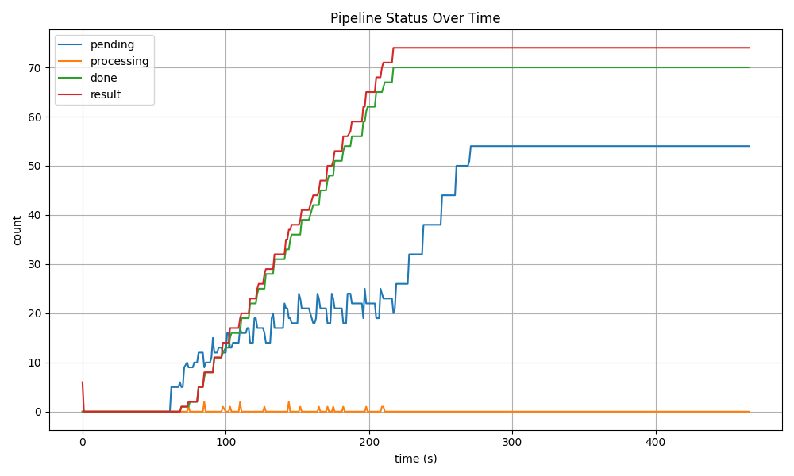

# KPC Autoscaler: Kubernetes‑style Autoscaling on PBS HPC Clusters

- HPC クラスタ（PBS）上で、CPU → GPU の 2 段階ジョブ  
- Kubernetes HPA のように自動スケールさせる非同期パイプライン  
- pending をメトリクスに G（GPU ジョブ）を自律制御する KPC Autoscaler を実装


## 概要 : HPC 上で “Kubernetes" 的なオートスケール” を実現
KPC Autoscaler は、PBS を用いた HPC クラスター上で
Kubernetes Horizontal Pod Autoscaler (HPA) の概念を再現した
C/G 非同期パイプライン制御システムです。

- C（preprocess） が連続的にジョブを生成する Producer

- G（train） が pending キューを処理する Consumer

- pending ディレクトリ をメトリクスとして監視

- pending の量に応じて G の投入数を自動スケール

- 時系列ログと PNG グラフで パイプラインの流れを可視化

HPC 上で “Kubernetes 的なオートスケール” を実現するための
最小で強力なアーキテクチャです。

---

## Architecture Overview

```text
[C Producer] --(batch)--> batch_pending --(pick)--> [G Consumer]
↑                                           ↓
└────────────── KPC Autoscaler ─────────────┘

log_status.sh → pipeline_status.log → plot_status.py → PNG

```

- C（preprocess）  
  CPU ノードで入力データを生成し、`batch_pending/` に投入する Producer。

- G（train）  
  GPU ノードで pending を処理し、`batch_done/` と `result/` に出力する Consumer。

- KPC Autoscaler（run_pipeline.sh）  
  pending の量をメトリクスとして監視し、G の投入数を自動スケールする HPC 版 HPA（Horizontal Pod Autoscaler）。

- log_status.sh / plot_status.py  
  パイプラインの状態を時系列ログとして収集し、PNG グラフで可視化する。

---

## KPC Autoscaler（run_pipeline.sh）
Kubernetes の HPA と同じ思想で、pending をメトリクスとして
G（Consumer）をスケールアウトする。

```bash
#!/bin/bash
#
# KPC Autoscaler (Kubernetes for PBS Clusters)
# -------------------------------------------
# C = Producer (preprocess)
# G = Consumer (train)
# pending = Queue length (HPA のメトリクス)
# このスクリプトは pending を監視し、G を自動スケールする。

# GitHub 公開用（ダミー絶対パス）
BASE=/ABSOLUTE/PATH/TO/pipeline
SRC=$BASE/src

# --- Autoscaler parameters ---
INTERVAL=30          # ループ間隔（秒）
PENDING_HIGH=5       # pending がこの値を超えたら G をスケールアウト
G_SCALE_HIGH=3       # pending が多いときに投入する G の数
G_SCALE_LOW=1        # pending が少ないときに投入する G の数

while true; do
    # --- 現在の pending 数を取得 ---
    PENDING=$(ls $BASE/batch_pending | wc -l)

    # --- Producer: C を常に投入 ---
    qsub $SRC/sbatch_preprocess.sh
    echo "$(date) : submitted C"

    # --- Consumer: pending に応じて G をスケール ---
    if [ $PENDING -gt $PENDING_HIGH ]; then
        for i in $(seq 1 $G_SCALE_HIGH); do
            qsub $SRC/sbatch_train.sh
        done
        echo "$(date) : scale up G x$G_SCALE_HIGH (pending=$PENDING)"

    elif [ $PENDING -gt 0 ]; then
        for i in $(seq 1 $G_SCALE_LOW); do
            qsub $SRC/sbatch_train.sh
        done
        echo "$(date) : scale up G x$G_SCALE_LOW (pending=$PENDING)"

    else
        echo "$(date) : no pending"
    fi

    sleep $INTERVAL
done
```

## Directory Structure

```text
project/
├── src/
│   ├── preprocess.py
│   ├── train.py
│   ├── sbatch_preprocess.sh
│   ├── sbatch_train.sh
│   ├── run_pipeline.sh        # KPC Autoscaler
│   └── plot_status.py
├── scripts/
│   └── log_status.sh
├── pipeline/
│   ├── batch_pending/
│   ├── batch_processing/
│   ├── batch_done/
│   └── result/
└── result/
    └── pipeline_status_example.png
```


## Pipeline Flow

```text
CPU node → preprocess.py → batch_pending/batch_<JOBID>.opbs/
GPU node → train.py      → result/result_<JOBID>.opbs/
```

- C が一定間隔でバッチを生成
- G が pending を監視しながら複数並列で処理
- KPC Autoscaler が pending の量に応じて G を自動スケール

全体が「流れ続ける」非同期パイプラインを形成する

## Example Output
📊 可視化（PNG 出力）
log_status.sh が時系列ログを収集し、
plot_status.py が PNG グラフを生成します。

```text
pipeline/
├── batch_xxxxxxx.opbs/
│   └── input.txt
└── result_xxxxx.opbs/
    └── result.txt
```
可視化例（PNG）では:
- pending が上下に揺れながら安定
- result が右肩上がりで増加
- done が階段状に増える
- processing が 0〜1 の間で点々と動く

→ Kubernetes HPA と同じ波形が HPC 上で再現される。

## Graph
※ 本グラフは 一般的な HPC クラスタの PBS ジョブ制限下で
KPC Autoscaler を実行した際の実測例です。

pending が高止まりしているのは、PBS の最大ジョブ数に達したためであり、
Autoscaler 自体は正しく動作しています。

HPC の制約下でどのようにスケール挙動が変化するかを示す
リアルなサンプルとして掲載しています。

※ 本実験は PBS のジョブ制限を尊重し、クラスターに負荷をかけない範囲で実施しています。




## Usage

1.ログ収集開始

```bash
scripts/log_status.sh
```

2.KPC Autoscaler 起動

```bash
src/run_pipeline.sh
```
3.しばらく流す

4.PNG 可視化

```bash
python src/plot_status.py
```
5.ローカルで確認

```bash
scp pipeline_status.png local/
```

## Design Concept: HPC × Kubernetes

HPC でも Kubernetes 的オートスケールは実現できることを示す、
ミニマルで強力なアーキテクチャ。

> HPCワークフローをKubernetesの構成要素に対応付けた一覧

| KPC（本作）        | Kubernetes        |
|-------------------|------------------|
| pending         | CPU/メモリ使用率 |
| G(train)       | Pod              |
| C (preprocess)  | Producer Pod     |
| run_pipeline.sh | HPA Controller   |
| PBS             | Node Scheduler   |

## 可視化 実行処理モニタリング
別ターミナルにて実行
```code
watch -n 1 "
echo 'pending:'; ls /ABSOLUTE/PATH/TO/pipeline/batch_pending | wc -l;
echo 'processing:'; ls /ABSOLUTE/PATH/TO/pipeline/batch_processing | wc -l;
echo 'done:'; ls /ABSOLUTE/PATH/TO/pipeline/batch_done | wc -l;
echo 'result:'; ls /ABSOLUTE/PATH/TO/pipeline/result | wc -l;
"
````

例
```text
pending:     2   <-未処理バッチ数
processing:  0　 <-処理中バッチ数
done:        3　 <-処理完了バッチ数
result:      8　 <-処理結果数
```
